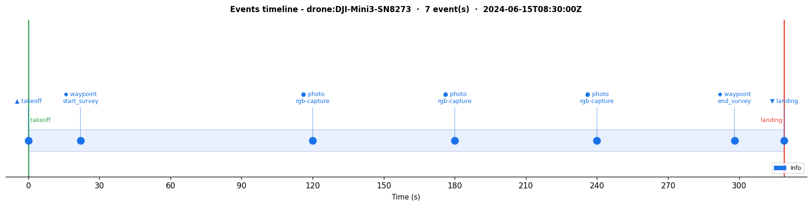

# pymfx

[](https://github.com/jabahm/pymfx/actions/workflows/ci.yml)
[](https://pypi.org/project/pymfx/)
[](https://codecov.io/gh/jabahm/pymfx)
[](https://jabahm.github.io/pymfx)
[](https://github.com/jabahm/pymfx)

Python library for the **Mission Flight Exchange** (`.mfx`) format — an open plain-text format for UAV mission data built for [FAIR](https://www.go-fair.org/fair-principles/) compliance.

```bash
pip install pymfx          # core (zero dependencies)
pip install pymfx[viz]     # + folium maps & matplotlib plots
pip install pymfx[ds]      # + pandas DataFrame integration
```

---

## Parse · Validate · Stats · FAIR

```python
import pymfx

mfx = pymfx.parse("flight.mfx")

pymfx.validate(mfx)
```
```
✓ Valid file - no issues found.
```

```python
print(pymfx.flight_stats(mfx))
```
```
┌──────────────────────────────────────────┐
│  Flight Statistics                        │
├──────────────────────────────────────────┤
│  Points        : 320                    │
│  Duration      : 319.0 s                │
│  Distance      : 2450.27 m              │
│  Distance (km) : 2.450                  │
├──────────────────────────────────────────┤
│  Alt max       : 55.6 m                 │
│  Alt min       : 0.0 m                  │
│  Alt mean      : 47.3 m                 │
├──────────────────────────────────────────┤
│  Speed max     : 11.3 m/s               │
│  Speed mean    : 8.1 m/s                │
└──────────────────────────────────────────┘
```

```python
score = pymfx.fair_score(mfx)
print(f"S = {score.S:.2f}  (F={score.F:.2f} A={score.A:.2f} I={score.interop:.2f} R={score.R:.2f})")
print(score.breakdown())
```
```
S = 1.00  (F=1.00 A=1.00 I=1.00 R=1.00)

Criterion                                      Pts  Max  Pass
------------------------------------------------------------
  F  id is a valid UUID                         10   10  ✓
  F  [index] bbox present                        8    8  ✓
  F  [meta] is first section                     7    7  ✓

  A  license present and SPDX-valid             10   10  ✓
  A  contact present                             8    8  ✓
  A  status declared                             7    7  ✓

  I  @schema present in [trajectory]             8    8  ✓
  I  crs declared                                7    7  ✓
  I  sensors from controlled vocabulary          5    5  ✓
  I  altitude_ref declared                       5    5  ✓

  R  @checksum valid in [trajectory]             8    8  ✓
  R  data_level declared                         7    7  ✓
  R  producer + producer_version                 5    5  ✓
  R  source_format declared                      5    5  ✓

------------------------------------------------------------
  F=1.00  A=1.00  I=1.00  R=1.00   →  S₀ = 1.00
```

```python
pymfx.write(mfx, "out.mfx")  # auto-computes SHA-256 checksums
```

---

## Visualize

```python
import pymfx.viz as viz

viz.trajectory_map(mfx)       # interactive folium map (green → red gradient)
viz.speed_heatmap(mfx)        # map coloured by speed
viz.compare_map([mfx1, mfx2]) # multi-flight overlay
viz.flight_profile(mfx)       # altitude / speed / heading over time
viz.flight_3d(mfx)            # 3-D lat/lon/alt trajectory
viz.events_timeline(mfx)      # events on the flight timeline
```





---

## Convert

```python
mfx = pymfx.convert.from_dji_csv("DJIFlightRecord.csv")  # AirData or DJI Fly
mfx = pymfx.convert.from_gpx("track.gpx")
mfx = pymfx.convert.from_geojson("route.geojson")
mfx = pymfx.convert.from_csv("points.csv")

pymfx.convert.to_geojson(mfx)  # → GeoJSON FeatureCollection
pymfx.convert.to_gpx(mfx)      # → GPX 1.1
pymfx.convert.to_kml(mfx)      # → KML (Google Earth)
pymfx.convert.to_csv(mfx)      # → CSV
```

---

## DataFrame

```python
df = mfx.trajectory.to_dataframe(events=mfx.events)
```
```
      t      lat     lon   alt_m  speed_ms  event_type
    0.0  48.7733  2.2858     0.0       1.9     takeoff
    1.0  48.7733  2.2859     2.5       2.4     takeoff
   22.0  48.7733  2.2880    54.6       8.9    waypoint
  120.0  48.7739  2.2898    48.3       9.3       photo
  180.0  48.7741  2.2878    46.2       8.2       photo
  319.0  48.7733  2.2858     0.0       1.2     landing
```

---

## CLI

```bash
pymfx flight.mfx --validate
pymfx flight.mfx --stats
pymfx flight.mfx --info
pymfx flight.mfx --checksum
pymfx flight.mfx --diff other.mfx
pymfx flight.mfx --export geojson -o out.geojson
```

---

## The .mfx format

Plain text, structured sections, human-readable:

```
@mfx 1.0
@encoding UTF-8

[meta]
id            : uuid:f47ac10b-58cc-4372-a567-0e02b2c3d479
drone_id      : drone:DJI-Mini3-SN8273
drone_type    : multirotor
pilot_id      : pilot:ahmed-jabrane
date_start    : 2025-06-15T08:30:00Z
date_end      : 2025-06-15T08:35:19Z
status        : complete
application   : environmental-monitoring
location      : Parc de Sceaux, FR
sensors       : [rgb, thermal]
data_level    : raw
license       : CC-BY-4.0
contact       : ahmed@example.org

[trajectory]
frequency_hz  : 1.0
@checksum sha256:b1f2bc...
@schema point: {t:float [no_null], lat:float [no_null], lon:float [no_null], alt_m:float32, speed_ms:float32, heading:float32}
data[]:
0.000 | 48.7733 | 2.2858 | 52.1 | 3.2 | 182.0
1.000 | 48.7734 | 2.2859 | 54.3 | 4.1 | 183.0
...

[index]
bbox      : (2.2858, 48.7733, 2.2901, 48.7751)
anomalies : 0
```

---

## License

MIT · Format spec: CC BY 4.0
