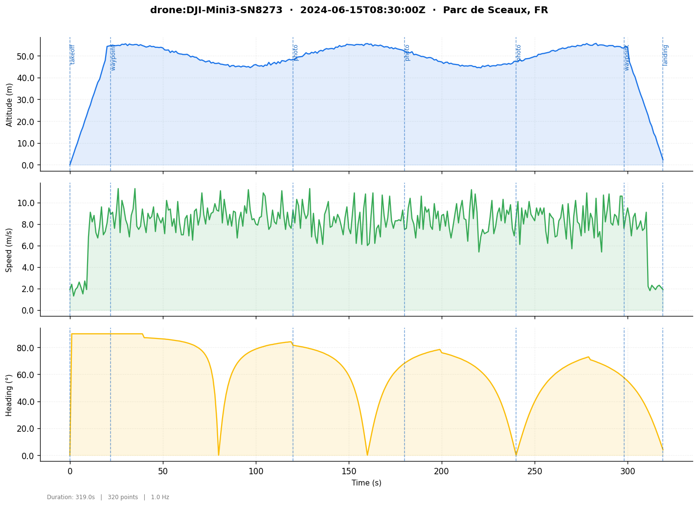
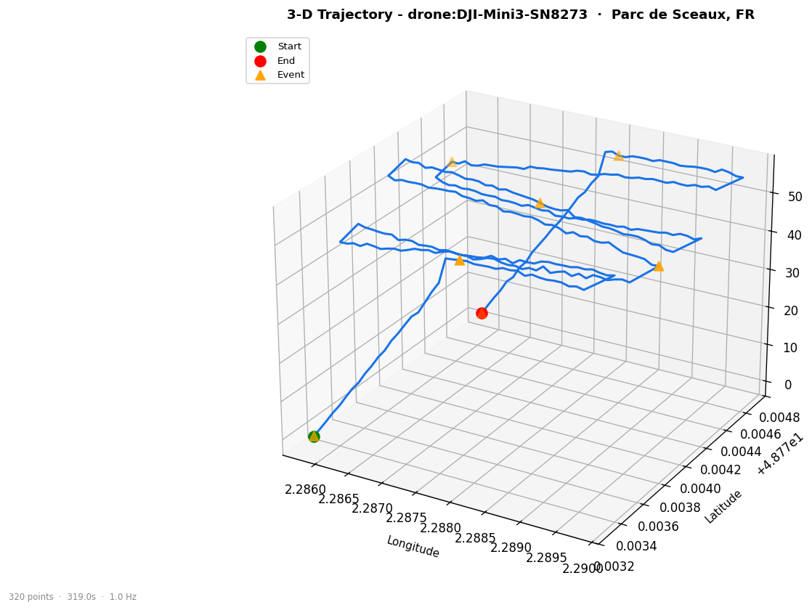

# pymfx

[](https://github.com/jabahm/pymfx/actions/workflows/ci.yml)
[](https://pypi.org/project/pymfx/)
[](https://codecov.io/gh/jabahm/pymfx)
[](https://jabahm.github.io/pymfx)
[](https://github.com/jabahm/pymfx)

Python library for the [Mission Flight Exchange](https://github.com/jabahm/pymfx) `.mfx` format.

```bash
pip install pymfx
```

## Package

```python
import pymfx

mfx = pymfx.parse("flight.mfx")
pymfx.validate(mfx)
pymfx.flight_stats(mfx)
pymfx.fair_score(mfx)
pymfx.detect_anomalies(mfx)
pymfx.write(mfx, "out.mfx")
```

**Convert**

```python
mfx = pymfx.convert.from_dji_csv("log.csv")
mfx = pymfx.convert.from_gpx("track.gpx")
mfx = pymfx.convert.from_geojson("route.geojson")

pymfx.convert.to_gpx(mfx)
pymfx.convert.to_kml(mfx)
pymfx.convert.to_csv(mfx)
```

**Visualize** (`pymfx[viz]`)

```python
import pymfx.viz as viz

viz.trajectory_map(mfx)
viz.flight_profile(mfx)
viz.flight_3d(mfx)
viz.events_timeline(mfx)
```





**DataFrame** (`pymfx[ds]`)

```python
df = mfx.trajectory.to_dataframe(events=mfx.events)
```

## TUI

```bash
pip install pymfx[tui]
pymfx flight.mfx --tui
```

| Key | Tab |
|-----|-----|
| `1` | Overview |
| `2` | Trajectory |
| `3` | Events |
| `4` | Statistics |
| `5` | Anomalies |
| `6` | Raw |
| `e` | Export |


## CLI

```bash
pymfx flight.mfx --validate
pymfx flight.mfx --info
pymfx flight.mfx --stats
pymfx flight.mfx --checksum
pymfx flight.mfx --anomalies
pymfx flight.mfx --diff other.mfx

pymfx flight.mfx --export geojson -o out.geojson
pymfx flight.mfx --export gpx -o out.gpx

pymfx track.gpx --import gpx -o flight.mfx
pymfx log.csv   --import dji -o flight.mfx

pymfx flight.mfx --repair -o fixed.mfx
```

## Format

```
@mfx 1.0
@encoding UTF-8

[meta]
id            : uuid:f47ac10b-58cc-4372-a567-0e02b2c3d479
drone_id      : drone:DJI-Mini3-SN8273
drone_type    : multirotor
pilot_id      : pilot:ahmed-jabrane
date_start    : 2025-06-15T08:30:00Z
date_end      : 2025-06-15T08:35:19Z
status        : complete
sensors       : [rgb, thermal]
license       : CC-BY-4.0

[trajectory]
frequency_hz  : 1.0
@checksum sha256:b1f2bc...
@schema point: {t:float [no_null], lat:float [no_null], lon:float [no_null], alt_m:float32, speed_ms:float32}
data[]:
0.000 | 48.7733 | 2.2858 | 52.1 | 3.2
1.000 | 48.7734 | 2.2859 | 54.3 | 4.1

[index]
bbox      : (2.2858, 48.7733, 2.2901, 48.7751)
anomalies : 0
```

## License

MIT
